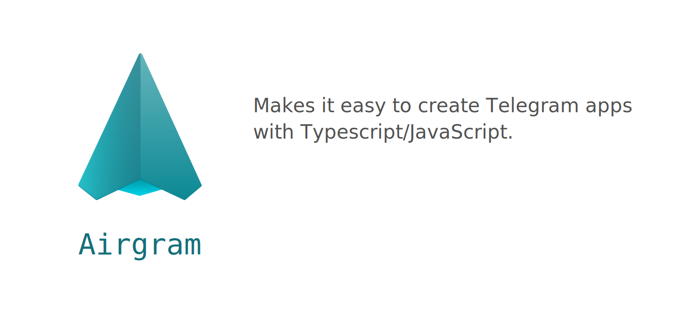

# Airgram [](https://twitter.com/intent/tweet?text=Wow:&url=https%3A%2F%2Fgithub.com%2Fairgram%2Fairgram)

This is a wrapper for [Telegram Database library](https://github.com/tdlib/td) written in TypeScript.




- **Code style.** TDLib follows a different coding convention than best practices in TypeScript or JavaScript. Airgram fixes it.
- **Methods.** Each API method has convenient wrapper with description and JSDoc documentation.
- **Type checking.** Airgram is a true TypeScript library. Everything has strict typings, so take full advantage of type checking and code completion. 
- **Flexibility.** Airgram relies on middleware. This gives a high degree of freedom. You can modify requests, save responses, perform any actions in the data flow. 
- **Data models.** You can extend standard TDLib objects and add some computed properties or whatever you want. 
- **Use everywhere.** Airgram is an environment agnostic library. It will work in the browser as well as in Node.js. You can write Telegram client or use it for a Telegram bot backend. 

___

[](https://www.npmjs.com/package/airgram)
[](https://github.com/tdlib/td)
[](http://standardjs.com/)
[](/blob/master/LICENSE)
<!-- [](https://www.npmjs.com/package/airgram) -->
___

## Installation
**Node.js**
1. Build TDLib library according the [instruction](https://github.com/tdlib/td#building).
2. Install [node-gyp](https://github.com/nodejs/node-gyp#installation)
3. Install Airgram:
```bash
npm install airgram
```
**Web**
```bash
npm install @airgram/web
```

Check out [webpack config](https://github.com/airgram/airgram/tree/master/examples/webpack-config) example.

## Getting started
```typescript
import { Airgram, Auth, prompt, toObject } from 'airgram'

const airgram = new Airgram({
  apiId: process.env.APP_ID,
  apiHash: process.env.APP_HASH
})

airgram.use(new Auth({
  code: () => prompt(`Please enter the secret code:\n`),
  phoneNumber: () => prompt(`Please enter your phone number:\n`)
}))

void (async () => {
  const me = toObject(await airgram.api.getMe())
  console.log(`[me]`, me)
})

// Getting all updates
airgram.use((ctx, next) => {
  if ('update' in ctx) {
    console.log(`[all updates][${ctx._}]`, JSON.stringify(ctx.update))
  }
  return next()
})

// Getting new messages
airgram.on('updateNewMessage', async ({ update }, next) => {
  const { message } = update
  console.log('[new message]', message)
  return next()
})
```

## Documentation
Guides and API-reference are available [here](https://airgram.io).

## Old version
If you are interested in `v1.*`, follow to corresponding [branch](https://github.com/airgram/airgram/tree/v1).

## License

The source code is licensed under GPL v3. License is available [here](/LICENSE).
